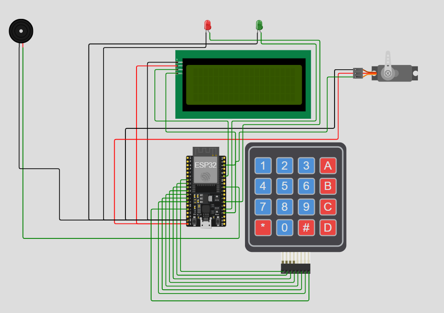

# ESP32 Access Control System

Système de contrôle d’accès avec ESP32 et MicroPython. Utilise un **clavier 4x4** pour entrer un code PIN, un **LCD 16x2 I2C** pour afficher le statut, un **servo** pour ouvrir la porte, des **LEDs verte/rouge** pour indiquer l’accès et un **buzzer** pour alerter en cas de code incorrect.

## Fonctionnalités
- Entrée de code via clavier matriciel 4x4
- Affichage des instructions et du statut sur LCD I2C
- Servo moteur simulant l’ouverture d’une porte
- LED verte pour accès autorisé, LED rouge pour accès refusé
- Buzzer pour signaler une erreur de code

## Matériel utilisé
- ESP32 Dev Module
- LCD 16x2 I2C (PCF8574)
- Clavier matriciel 4x4
- Servo SG90
- LED verte et LED rouge
- Buzzer actif
- Breadboard et câbles

## Schéma de câblage
- LCD I2C : SDA → GPIO21, SCL → GPIO22
- Servo : Signal → GPIO15
- LED verte → GPIO2
- LED rouge → GPIO4
- Buzzer → GPIO18
- Clavier matriciel :
  - Lignes R1-R4 → GPIO32, GPIO33, GPIO25, GPIO26
  - Colonnes C1-C4 → GPIO27, GPIO14, GPIO12, GPIO13

## Instructions
1. Charger tous les fichiers (`main.py`, `i2c_lcd.py`, `lcd_api.py`, `keypad.py`) dans le projet Wokwi ou sur ESP32.
2. Lancer la simulation ou exécuter sur le microcontrôleur.
3. Saisir le code PIN via le clavier. `#` pour valider, `*` pour réinitialiser.
4. Observer le servo, les LEDs et le buzzer selon le code saisi.

## Objectif pédagogique
- Apprendre MicroPython sur ESP32
- Interfacer LCD, clavier, servo et LEDs
- Créer un projet de contrôle d’accès simple et fonctionnel

## Schéma de câblage

## Licence
MIT License
